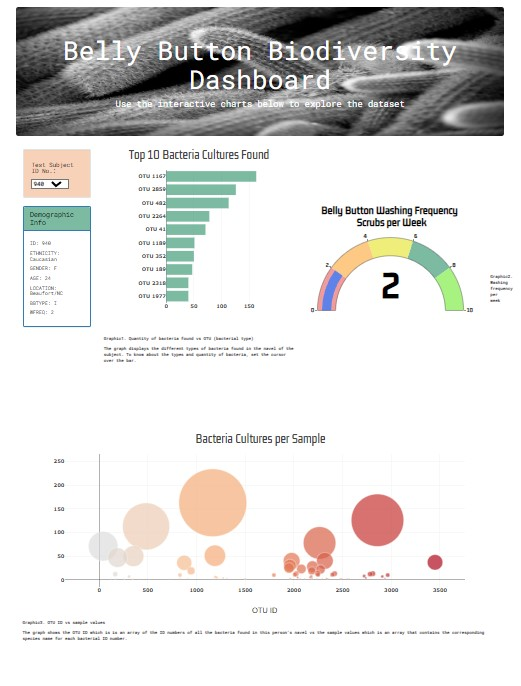

# Data visualization with JavaScript, Plotly, HTML, CSS and Bootstrap

Roza is a biological researcher in a prominent microbiology laboratory. 
She wants to document unknown bacterias that can synthesis proteins that taste like beef.  
Her lab has partenerd with Improbable beef, a food startup to research candidates species. 
Roza has a hypothesis that there's a microorganism that could be found on the human belly
button. To test her hypothesis, she has sampled the navels of people across the country to identify
bacterial species that colonize their belly button. Each person identity is anonimous and
were assigned an ID number. 
We will implement an interactive dashboard to participants, and fellow researchers can access. 
The participants will be able to look for their results using their ID number.

## Overview

The task was to display 3 different graphs and a selector that allow the users to select an ID and see the results for that ID.  
D3 was used to import the data from the json file, four functions were created, a function to initiate the graphs, a function that reacts to the change of an ID, a function to display the "Demographic information", and a function to build the graphs with the support of plotly. 
Finally a CSS file and HTML were created to display and give format to the website.

### Information to understand the graphs

 * The id key identifies the ID number.  
 * The otu_ids property is an array of the ID numbers of all the bacteria found in this person's navel.  
OTU stands for Operational Taxonomic Unit, and here it means species or bacterial type.  
* The sample_values array contains the corresponding species name for each bacterial ID number.   
Some bacterial species have different ID numbers, but are clumped together under the same otu_label.

## To view the webpage clic this link <a href="https://antongit505.github.io/belly-button-biodiversity/"> Belly Button </a> 

